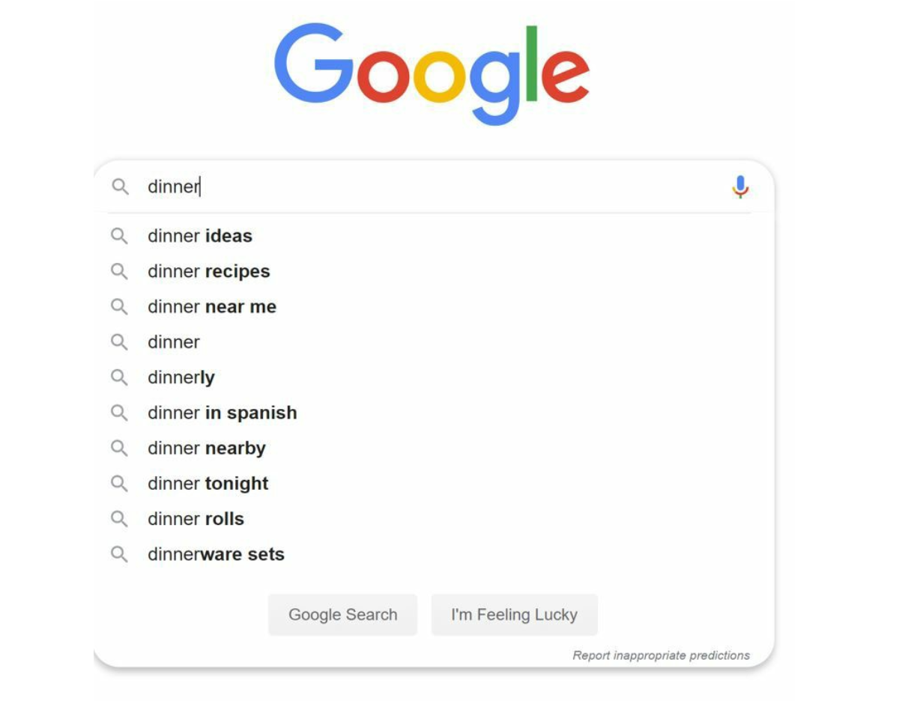
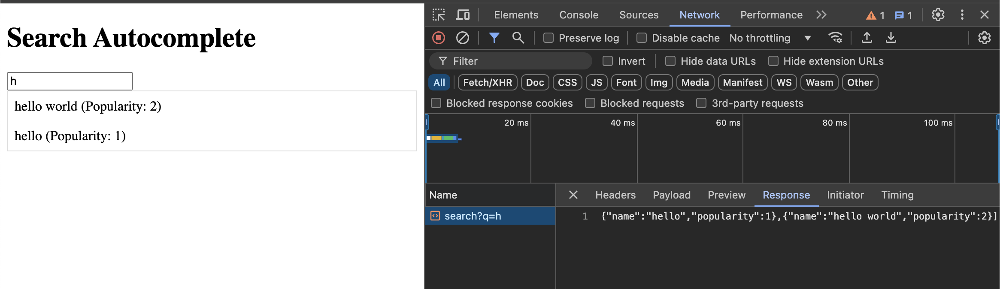

### SEARCH AUTOCOMPLETE SYSTEM

When searching on Google or shopping at Amazon, as you type in the search box, one or more matches for the search term are presented to you. This feature is referred to as autocomplete, typeahead, search-as-you-type, or incremental search. Figure 1 presents an example of a Google search showing a list of autocompleted results when “dinner” is typed into the search box. Search autocomplete is an important feature of many products. This leads us to the interview question: design a search autocomplete system, also called “design top k” or “design top k most searched queries”.

TODO:
- Create backend folder and implement your solution there.
    - backend should have these endpoints:
        - /search?q={}          | 
            (request: GET /search?q=app | response: [ { "name": "Apple", "popularity": 10 }, { "name": "Application", "popularity": 5 }]) 
        - /add-item             |
            (request: POST /add-item { "item": "Appetizer" } | response: { "status": "success", "message": "Item added" }) 
        - /increase-popularity  |
            (request: PUT /increase-popularity { "item": "Appetizer" } | response: { "status": "success", "message": "Item updated" }) 
- Create/Update frontend request domain to test it.
    - when pressed enter, 
        - it should add new item if it's not listed
        - it's already exist, it should icnrease its popularity
    
